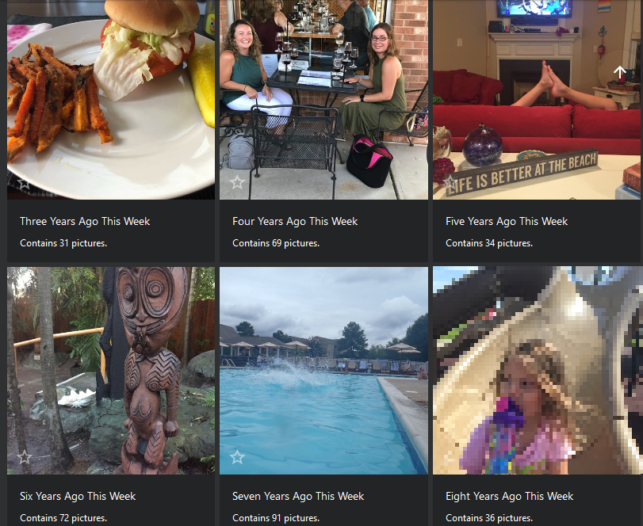
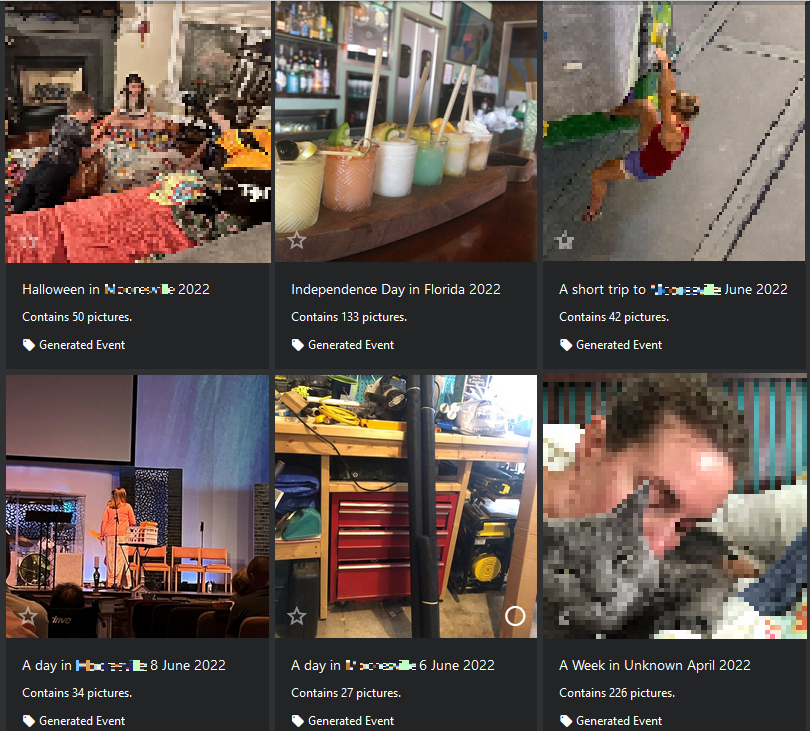
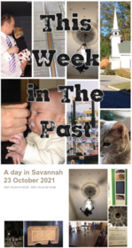

[](https://github.com/dlgreenwald/PhotoAlbumHelper) [](https://hub.docker.com/r/dlgreenwald/photoalbumhelper)

# PhotoAlbumHelper
 PhotoAlbumHelper is a badly named set of python scripts which provide some dynamic[^1] photo album functionality currently missing from [PhotoPrism](https://www.photoprism.app/).  Dockerfile and a docker-compose.yml file provide turnkey like behavior.  Each script will be run once a week.

PhotoAlbumHelper is provided is NOT affiliated with [PhotoPrism](https://www.photoprism.app/) in any way.  I just wanted to have some features I missed from other commercial photo software so I hacked it in.

[^1]: The album itself is not dynamic, but the jobs will remove and add photos dynamically once a week.

## In The Past
 
 <br/>
 The "In the Past" tooling creates albums which contain photos from the same calendar week in the past.  It will automatically create an album for 1 Week Ago, 1 Month Ago, and for all previous years in your photo timeline.  The script creates albums with a category of "In The Past". 


## Automatic Events
 
<br/>
 Automatic Events applies anomaly detection to your [PhotoPrism](https://www.photoprism.app/) timeline.  It calculates days where an abnormal number of photos are taken, connects concurrent dates, and applies some rising and falling edge detection.  The resulting start and end dates are used to create an album.  The album is named by examining the location tags on the photos and determining if there are one or two locations where 75% of the photos were taken, if a day in the event is a holiday (New Years, Memorial Day, Labor Day, Thanksgiving(US), Christmas, Easter, Valentines, or Halloween), and how long the event lasts.  Currently it will only examine the most recent 10k photos.

## This Week in the Past Emails



 Weekly emails create and send a weekly email compleate with photo collages made from images in the events.  All events are used, and are selected by the number of photos in the album and if the album is automatic or manual.  Email sending is disabled by default.
<br/>
<br/>
<br/>
<br/>
<br/>
<br/>
<br/>
<br/>
<br/>

## Future Improvements
 * Configurable Events (add birthday's or other holidays to the named list)
 * Configurable Process Schedule (Currently Automatic Events runs nightly@1am and In the Past runs weekly, Sundays@midnight)
 * Quality tagging of individual photos based on Neural Image Assessment and the Aesthetic Visual Analysis Dataset

## Tips
 * If there are a LARGE number of days in your timeline with zero photos this will skew the anomaly detection towards 0.  If that happens set EARLIESTDATE to when your photo taking behavior becomes predictable.

## Usage
Here is an example to help you get started creating a container.  Change TRIALRUN to False when you are ready to commit changes via the API.
### docker-compose
```
version: "2.1"
services:
  albumhelper:
    image: dlgreenwald/photoalbumhelper:latest
    container_name: albumhelper
    environment:
      - PHOTOPRISM_URI={PHOTOPRISM_URI}
      - STATIC_URI={STATIC_URI}
      - PHOTOPRISM_API_KEY={PHOTOPRISM_API_KEY}

      - TRIALRUN=True
      - EARLIESTDATE=2008-01-01

      # Path to write static files which will be located at {STATIC_UR}
      - FILEPATH=/static 
      - SHORTESTEVENT=1

      # Comma seperated list of email recipients
      - RECIPIENTS={RECIPIENTS} 
      - SENDER={SENDER}
      - SMTP_PASS={SMTP_PASS}
      - SMTP_SERVER={SMTP_SERVER}
      - SMTP_PORT={SMTP_PORT}
      - DISABLEEMAIL=True
```
 ## Parameters
 Container images are configure using parameters passed at runtime via environment variables.  

| Parameter | Use | Required | Function |
| :---: | :---: | :---: | ---|
| `-e PHOTOPRISM_URI=https://try.photoprism.app/` | General | True | Domain of the PhotoPrism instance |
| `-e PHOTOPRISM_API_KEY=[photoprism app token]` | Required | True |App token with permissions on the instance |
| `-e TRIALRUN=[True\|False]` | Required | False | indicate if changes should be commited via the API.  Default False. |
| `-e EARLIESTDATE=[Year-Month-Day]` | Automatic Events | False | indicates the earliest date which should be considered,  Defaults to 1900.  Change if you have large blocks of time with zero photos. |
| `-e LATESTDATE=[Year-Month-Day]` | Automatic Events| False | indicates the latest date which should be considered.  Defaults to 200 years in the future.  Override if like me you have a large number of photos when setting up and the older years you want different settings than more recent ones. |
| `-e SHORTESTEVENT=[Integer]` | Automatic Events | False | filters out any event shorter than this number of days.  Defaults to 1 day (i.e. no filtering)   |
| `-e DISABLEEMAIL=[True\|False]` | Weekly Email | False | Enable or Disable the sending of weekly emails.  Defaults to True |
| `-e FILEPATH=[Integer]` | Weekly Email | When DISABLEEMAIL== FALSE | determines where images should be stored for the weekly email.  This directory must be hosted by a webserver.   |
| `-e SMTP_PORT=[Integer]` | Weekly Email | When DISABLEEMAIL== FALSE | What port to use for SMTP.  For google this is 465  |
| `-e STATIC_URI=[String]` | Weekly Email | When DISABLEEMAIL== FALSE | Prefix URI for images to be loaded from in weekly email  |
| `-e SENDER=[String]` | Weekly Email | When DISABLEEMAIL== FALSE | Email address of the sender of the weekly email   |
| `-e RECIPIENTS=[String]` | Weekly Email | When DISABLEEMAIL== FALSE | Comma seperated list of recipients of the weekly email |
| `-e SMTP_PASS=[String]` | Weekly Email | When DISABLEEMAIL== FALSE | Password or Application Password for sending weekly emails|